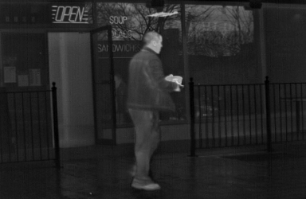

## Video Analysis

### Mean Shift Tracking with Corrected Background

Simple mean shift base tracking using background information, based on the paper _Robust mean-shift tracking with corrected
background-weighted histogram_ by Ning et al. 

{:height="40%" width="40%"} {:height="40%" width="40%"} {:height="40%" width="40%"}

### Abandoned Object Detection

Classification of statinary objects into abandoned or stolen, based on the paper _Robust unattended and stolen object detection by fusing simple algorithms_ by San Miguel and Martinez (). 

{:height="85%" width="85%"}

## Tomography and 3D Imaging

### 3D Image Reconstruction

Reconstruction of a mouse volume using filtered backprojection. 

{:height="50%" width="50%"}

## Natural Scene Statistics of Fused Long Wave Infrared and Visible Light Images

Small demonstration of the work presented in:

["Predicting the Quality of Fused Long Wave Infrared and Visible Light Images"](http://ieeexplore.ieee.org/document/7904687/), David-Moreno D.E., Benítez-Restrepo H.D., Bovik A.C.

Which proposes fused image quality metrics and presents a subjective human study for their construction and validation. Files included are: the Matlab implementation of an *opinion distortion unaware* and an *opinion aware fused image quality analyzer*, the original raw opinion scores, Z-scores after subject rejection, and Differential Mean Opinion Scores (DMOS). Please refer to the .

*Fused LWIR-visible light image*
