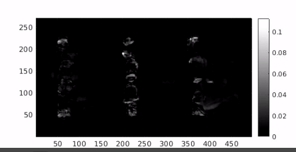

## Video Analysis

### Mean Shift Tracking with Corrected Background

Simple mean shift tracking implementation which uses background information, based on the paper _Robust mean-shift tracking with corrected
background-weighted histogram_ by Ning et al. It attempts to reduce the interference of background information in kernel-based tracking. Please refer to the  for the C++ code.



### Abandoned Object Detection

Classification of stationary objects into abandoned or stolen, based on the paper _Robust unattended and stolen object detection by fusing simple algorithms_ by San Miguel and Martinez (). 

{:height="85%" width="85%"}

## Tomography and 3D Imaging

### 3D Image Reconstruction

Reconstruction of a mouse volume using filtered backprojection. The Matlab implementation can be found in the 

{:height="50%" width="50%"}

## Natural Scene Statistics of Fused Long Wave Infrared and Visible Light Images

This is an image processing piece about quality assessment, which can be found puclicly in IEEE Transactions on Image Processing: ["Predicting the Quality of Fused Long Wave Infrared and Visible Light Images"](http://ieeexplore.ieee.org/document/7904687/), David-Moreno D.E., Benítez-Restrepo H.D., Bovik A.C. This work proposes fused image quality metrics and presents a subjective human study for their construction and validation. Please refer to the  for more details about the implementation.



